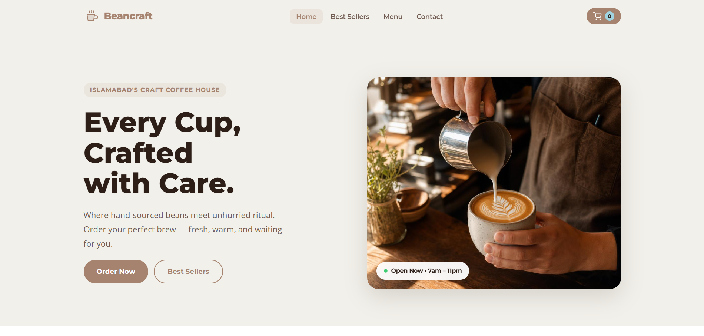
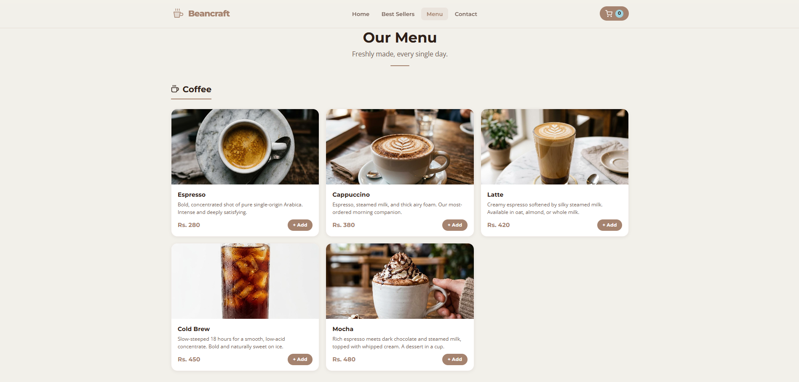
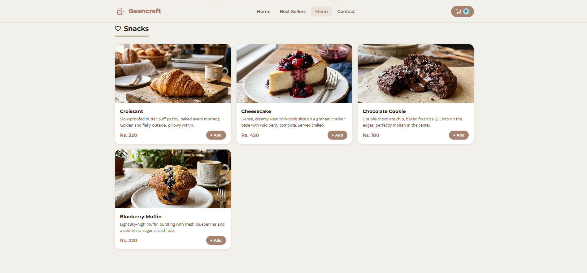
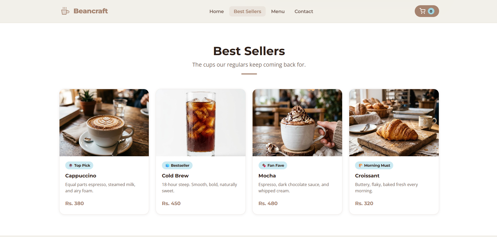
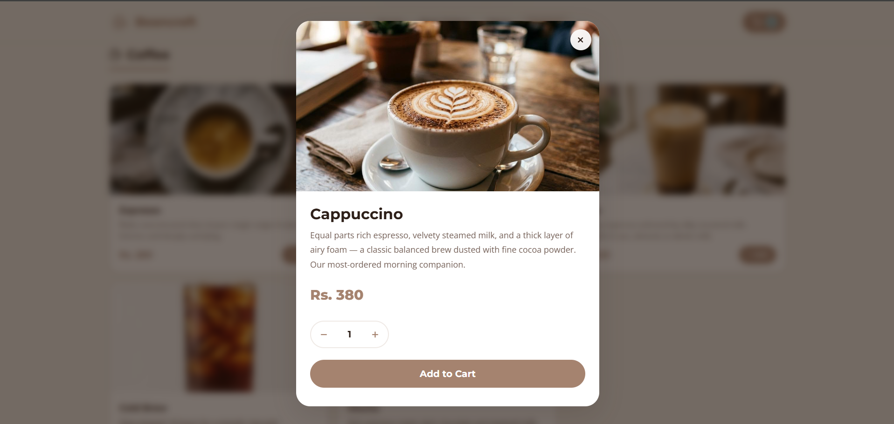
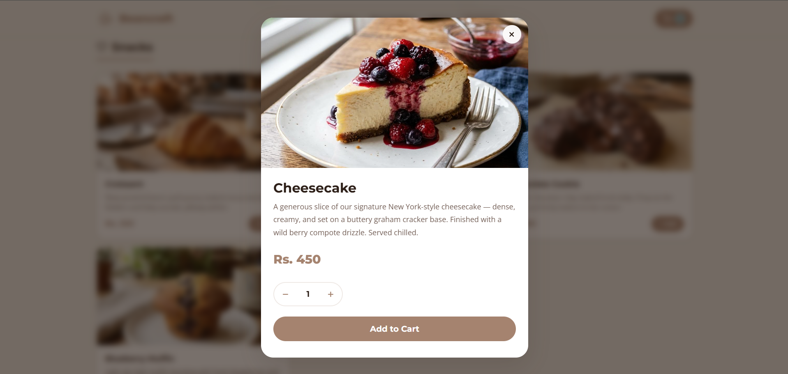
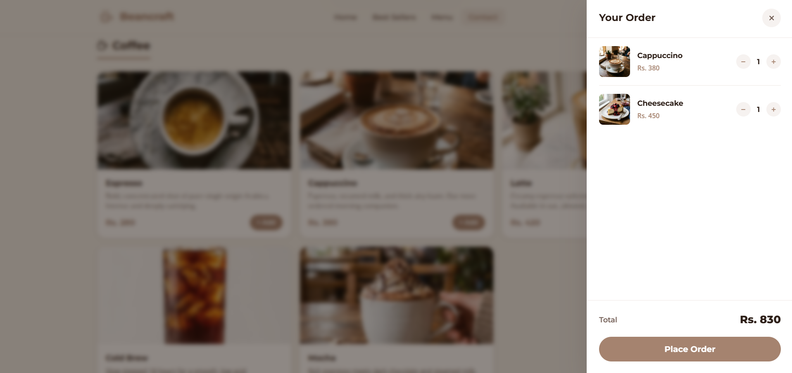
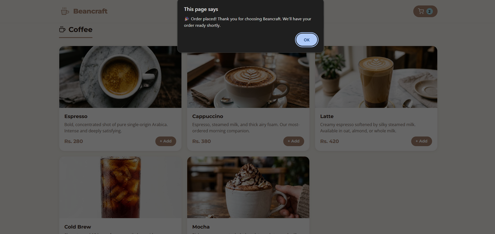
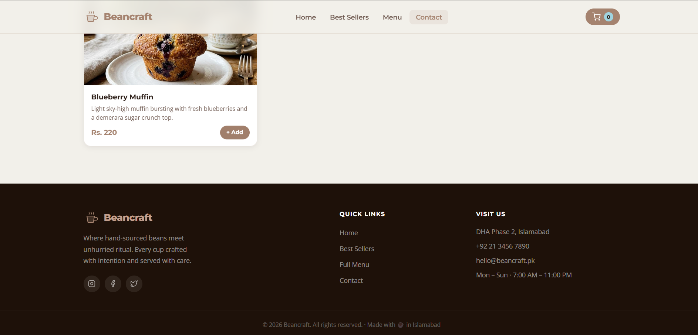

# ☕ BeanCraft — Premium Coffee Ordering Website

A fully responsive, accessible coffee ordering website built with pure HTML,
CSS, and vanilla JavaScript — no frameworks. Built as part of the
DecodeLabs Full Stack Development internship (Project 1: Responsive
Frontend Interface).

---

##  Screenshots

### Homepage


### Menu



### Best Sellers


### Product Detail & Ordering



### Placing Order


### Thanks for Ordering


### Contact


---

##  Features

-  Custom brand identity with a warm, 2025-inspired color palette
  (Mocha Mousse, Ethereal Blue, Moonlit Grey)
-  Fully responsive — mobile-first design with breakpoints at 768px
  (tablet) and 1024px (desktop)
-  Semantic HTML5 structure (`header`, `nav`, `main`, `article`, `footer`)
  for accessibility and SEO
-  Full menu with categorized items — coffee and snacks — each with
  images, descriptions, and prices in PKR
-  Add-to-cart functionality with a live cart drawer and running total
-  Product detail modal — click any item to see a full description,
  quantity selector, and add-to-cart option
-  Accessibility-focused — keyboard navigation, focus states, ARIA
  attributes, and `prefers-reduced-motion` support
-  Smooth CSS transitions on hover states, modal, and cart drawer

---

## Tech Stack

- **HTML5** — semantic structure
- **CSS3** — Grid & Flexbox layout, `clamp()` for fluid typography, custom
  properties for theming
- **Vanilla JavaScript** — cart logic, modal interactions, focus trapping,
  mobile navigation

No frameworks, no build tools required — the fundamentals only.

---

## Getting Started

Clone the repo and open it directly — no installation needed:

```bash
git clone https://github.com/<yamnakamal19-tech>/Bean-Craft.git
cd Bean-Craft
```

Then just open `index.html` in your browser.

---

## Project Structure

```
Bean-Craft/
├── index.html
├── style.css
├── script.js
├── favicon.svg
└── images/
    ├── hero.jpg
    ├── espresso.jpg
    ├── latte.jpg
    └── ...
```

---

## What I Learned

Building BeanCraft helped me practice:
- Structuring a real-world responsive layout from mobile-first principles
- Writing accessible, semantic HTML without relying on frameworks
- Managing UI state (cart, modals) in vanilla JavaScript
- Designing around a fixed color palette and typography system like a
  real client brief

---

## Contact

**Yamna**
First-year BS Artificial Intelligence student, CUST Islamabad
[LinkedIn](https://www.linkedin.com/in/yamna-alvi-119b9234b/)
[yamnakamal19@gmail.com](mailto:yamnakamal19@gmail.com)
